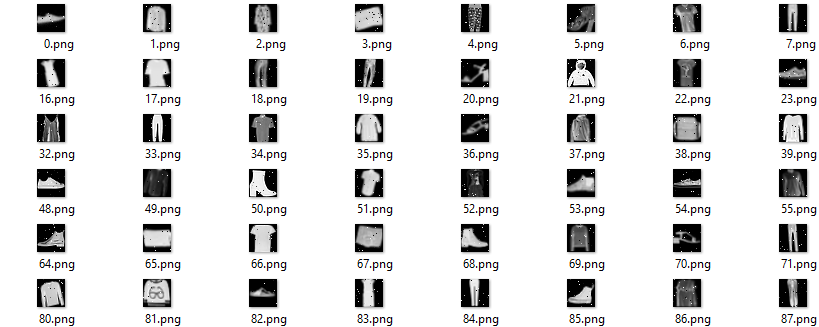

# GrayImg of Clothes dataset 10-Classification

By [Yixuan Wei](http://weiyx16.github.io/)

## Description

+ Image Type: Gray image with 28*28
+ Content Type: 10 kinds of clothes
+ Task: Classification
+ Class Number: 10

+ Win top 5% in a Kaggle competition in class, gaining 91.7% accuracy.

## Prepare

### Environment

+ Ubuntu 16.04, CUDA 9.0
+ Recommand to use anaconda.
+ Pytorch 1.1.0, and [other packages](./img/config.yaml)

### Data
Download [datasets](https://drive.google.com/drive/folders/1N6oFtBIO6kEdyHAOwvpUerSKoQ0cFlob?usp=sharing), and organize them as following:

```
code_root/
└── data/
    ├── src.npy
    ├── src.csv
    └── test.npy
```

Notice the src.npy and src.csv is the source image and label, test.npy is the test img in Kaggle.

## Usage
```sh
# Single GPU
$ ./dist_run.sh 1 ${GPU_IDX} main.py
# Multi GPU
$ ./dist_run.sh ${GPU_number} 0 main.py --dist
# E.g. Using 4 GPU
$ ./dist_run.sh 4 0 main.py --dist
```

## Method
+ A model structure similar to ResNet18 but adapted to input size with 28\*28\*1
+ LR Scheduler with 5% WarmUp and Linear Decline
+ AdamW Optimizer
+ Data Augmentation:R andomCrop+RandomRotation+RandomFlip+Normalization
+ With k folds cross validation
+ NCCL Backend Distribution

## Main Params
Here is [some params](https://github.com/weiyx16/MNIST_LIKE_Classification/blob/release/main.py#L61) you can change to obtain better result in your own dataset:
```python
# batchsize
batch_size = 64
# folds in cross validation
k_folds = 0  #5 #10
# Number of epochs to train
num_epochs = 100
# begin_lr
begin_lr = 3e-2
# lr_schedule
lr_schedule = 'triangle'  #plateau #cosine
warmupiter = 0.05  #0.01~0.1
# optimizer
optim_type = 'AdamW'  #SGD #Adam
```

## Comparison Experiment and ablation study
Besides, I also did lots of comparison experiments, and maybe some of them is not so "fair", but wish you to gain some insight. And sorry that the report is in Chinese, but the tables in it is in English which you may find no hard to read. See: [Report](https://drive.google.com/open?id=1wlt9Jfo-OT3I_exGLxp9nhp3GnHlBk8n)
+ Model Structure:
  + ResNet-18  
  + ResNet-34  
  + Vanilla ResNet-18  
  + ResNet-18 with half-channel  
  + DenseNet-121  
  + LeNet  
+ Learning rate scheduler
  + Plateau with different patience
  + Cosine Warmup with different warmup iters
  + Triangle Warmup with different warmup iters
+ Optimizer
  + SGD-Momentum
  + Adam
  + AdamW
+ Data augmentation
  + Flip
  + Rotate
  + Pepper noise

## Acknowedgements
Many thanks to these codes:
+ [DenseNet](https://github.com/bamos/densenet.pytorch/blob/master/densenet.py)
+ [Bert](https://github.com/huggingface/transformers)


## Citing

If you really need this repo, please follow this BibTex:  
```bibtex
@misc{LeafVein, 
    author = {Yixuan, Wei},
    title = {10 class classification on gray image of clothes},
    howpublished = {\url{https://github.com/weiyx16/MNIST_LIKE_Classification}},
    year = {2019}
}
```
